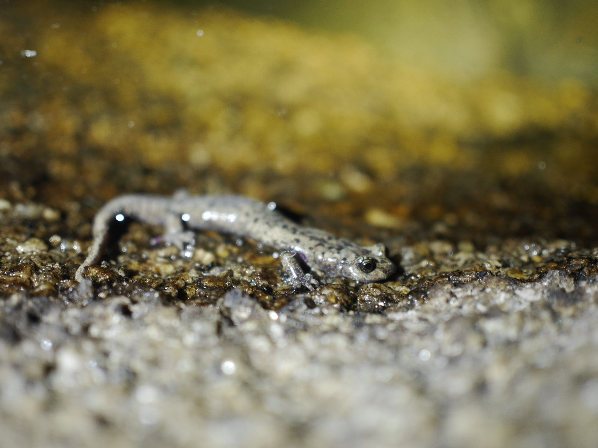

## The first description of Mount Lyell salamanders (*Hydromantes platycephalus*) occupying lakes in California's Sierra Nevada mountains

\

Parker Land\
[Sierra Nevada Aquatic Research Laboratory, Mammoth Lakes, California]{style="font-size: 0.4em"}

## Natural History

::::: columns
::: column
-   Endemic to the Sierra Nevada
-   One of the highest elevation salamanders in the world (Potluck Pass locality \~12,150ft)
-   Known to inhabit upland seeps, stream margins, and waterfall spray zones
:::

::: column

:::
:::::

## Our Sites

## South Lyell Basin, Yosemite National Park

::::: columns
::: column
-   60 H. platycephalus were found along the northern lake shore, including 3 submerged in the lake itself

-   Nearly all were observed on moss, in meadow vegetation, or at the base of a grassy bank along a sandy beach, and within 0–0.5 m of the lake.
:::

::: column
{height="48%"}
:::
:::::

## Embedded Video



## Goddard Plateau, Kings Canyon National Park

::::: columns
::: column
-   Nocturnal survey of entire lakeshore and inlets
-   Two individuals observed on the of the lake's overhanging vegetated bank
:::

::: column

:::
:::::

## Laurel Lakes, Sequoia National Park

::::: columns
::: column
-   

-   
:::

::: column

:::
:::::

## 

-   *H. platycephalus* occupies lakeshores and even underwater littoral habitats
-   The high abundances observed during some surveys (\>60 individuals in one instance) suggest suggests there is an unrecognized importance of lentic habitats for this poorly understood species
-   Observations in the Laurel Creek drainage, and earlier observations in the Coyote Creek drainage, extend the southern range west of the crest for this species by 3.9km