## First description of Mount Lyell salamanders (*Hydromantes platycephalus*) occupying lakes in California's Sierra Nevada mountains {style="font-size: 0.8em"}

\

Parker R. Land^1^*, Georgia Q. Lattig^1^, Leonie M. Walderich^1^, Jacob W. Staines^2^, Forest D. Peri^2^, Roland A. Knapp^1,2^\
^[1]{style="font-size: 0.5em"}^[Sierra Nevada Aquatic Research Laboratory, Mammoth Lakes, California]{style="font-size: 0.5em"}\
^[2]{style="font-size: 0.5em"}^[Resilience Institute Bridging Biological Training and Research, Quito, Ecuador]{style="font-size: 0.5em"}

## Natural History {style="font-size: 0.8em;"}

:::::: {style="margin-top: -10px;"}
::::: columns
::: {.column width="50%" style="font-size: 1em; padding-top: 20px;"}
*Hydromantes platycephalus*

- Family: Plethodontidae
- Endemic to the Sierra Nevada
- Wide elevational distribution
- Habitat: seeps, stream margins, waterfall spray zones
:::

::: {.column width="50%" style="padding-top: 10px"}
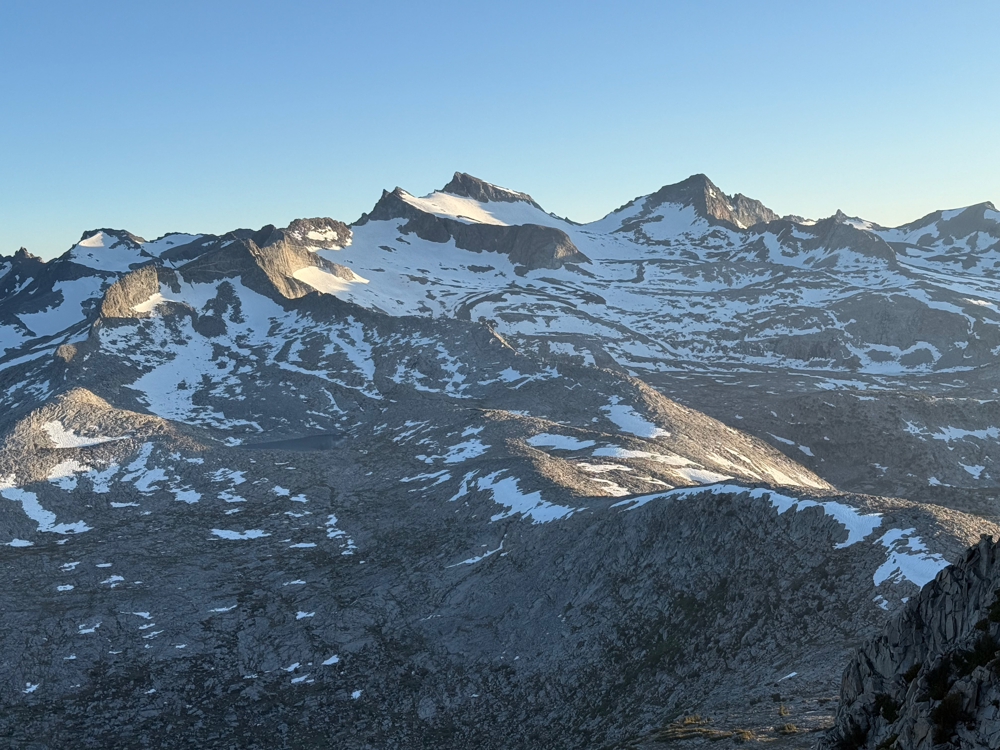{fig-align="center" height=350px}
{fig-align="center" style="width: 100%; max-height: 275px; object-fit: contain; margin-top: 0px;"}
:::
:::::
::::::

## Known *H. platycephalus* localities {.center style="font-size: 0.8em"}

::::: columns
::: {.column width="50%"}
::: r-stack
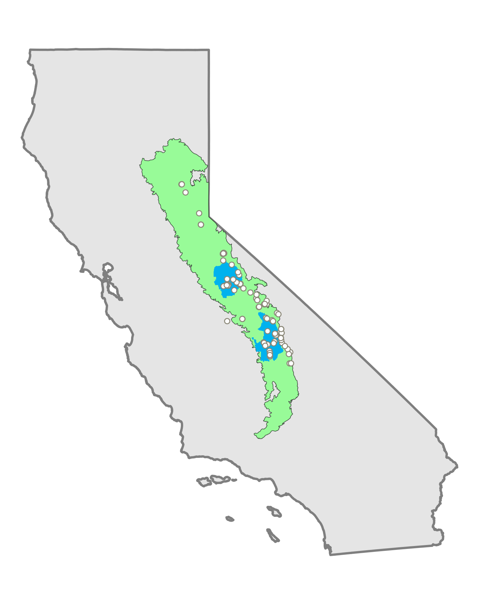{height="550px" style="vertical-align: top;"}

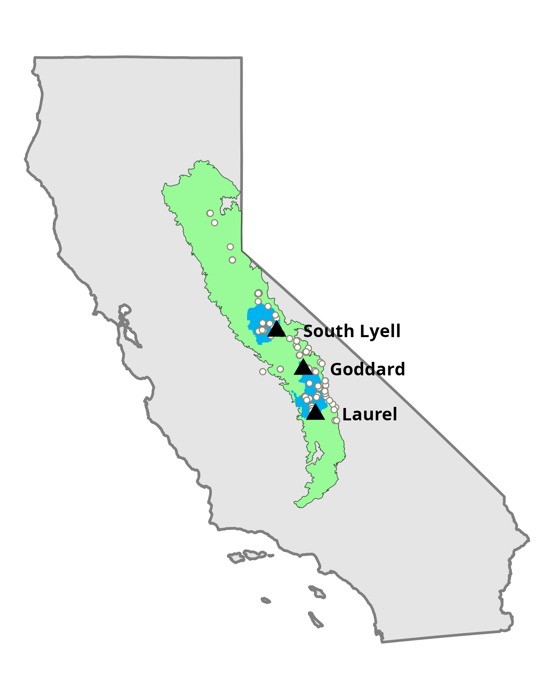{.fragment height="550px" style="vertical-align: top;"}
:::
:::
::: {.column width="50%"}
{height="500px" style="vertical-align: top;"}
:::
:::::

## South Lyell Basin, Yosemite National Park {style="font-size: 0.8em"}

::: {style="font-size: 0.87em; margin-bottom: 10px;"}
- **>60 *H. platycephalus*** along northern lakeshore, including **3 submerged** in lake.
- Found 0–0.5 m from lake: on moss, in meadow vegetation, under banks.
- 2 salamanders found along inlet stream in 2025, 11 found in 2024.
:::

::::: {.columns style="display: flex; align-items: center;"}
::: {.column width="50%"}
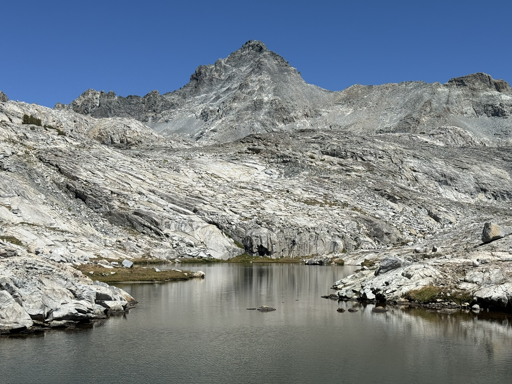{fig-align="center"}
:::

::: {.column width="50%"}
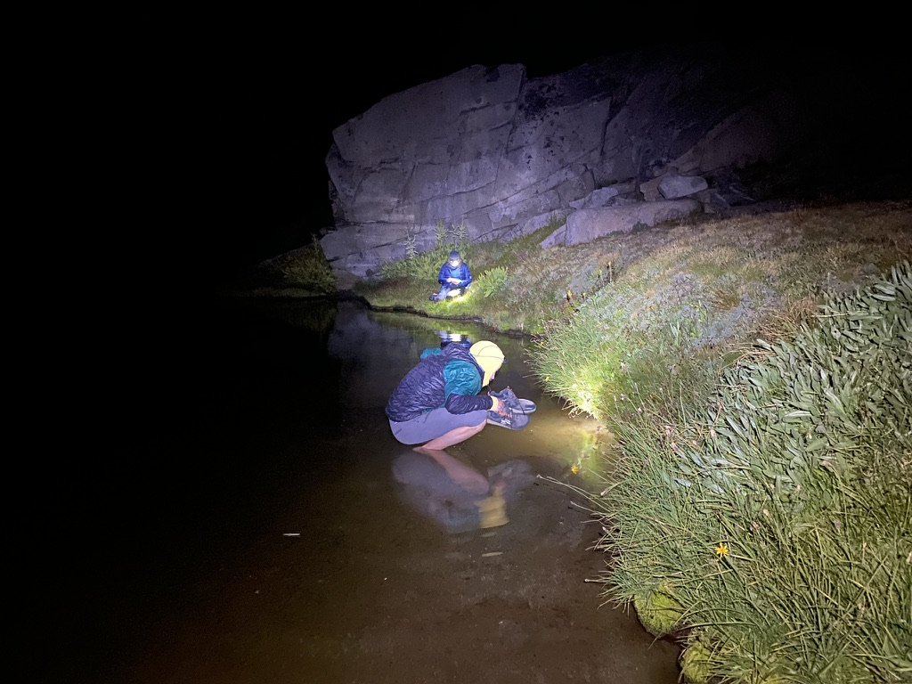{fig-align="center"}
:::
:::::

## Lakeshore habitat use {style="font-size: 0.8em"}



## Littoral habitat use {style="font-size: 0.8em"}

- **3 *H. platycephalus*** submerged in the lake at South Lyell.

:::::: columns
::: {.column width="33%"}
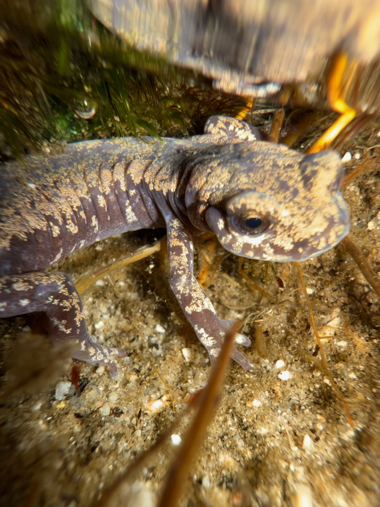
:::

::: {.column width="33%"}
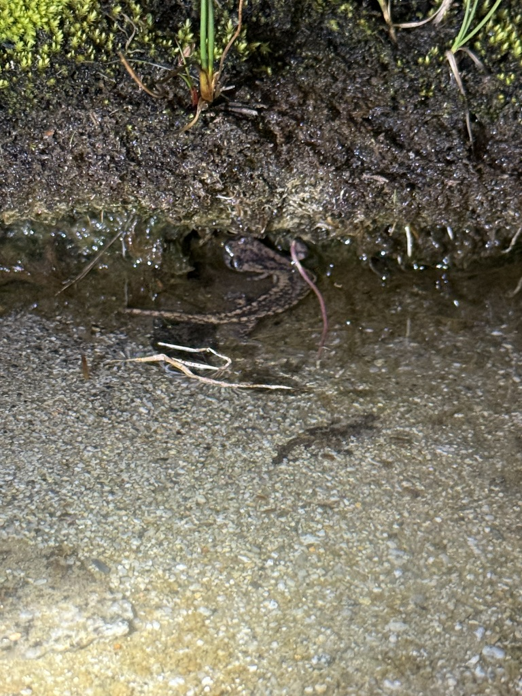
:::

::: {.column width="33%"}
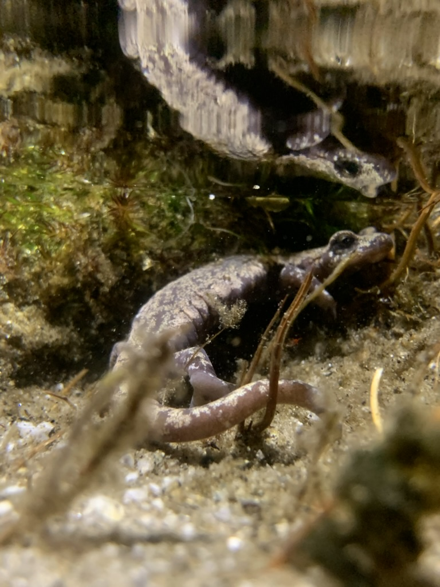
:::
::::::

## Goddard Plateau, Kings Canyon National Park {style="font-size: 0.8em"}

::: {style="font-size: 0.95em; margin-bottom: 10px;"}
-   **2 *H. platycephalus*** along northern lakeshore, **1** on southern shore.
-   Found 0-0.5m from lake: on edge of vegetated bank.
-   6-7 individuals under rocks along inlet stream during.
:::

::::: {.columns style="display: flex; align-items: center;"}
::: {.column width="60%"}
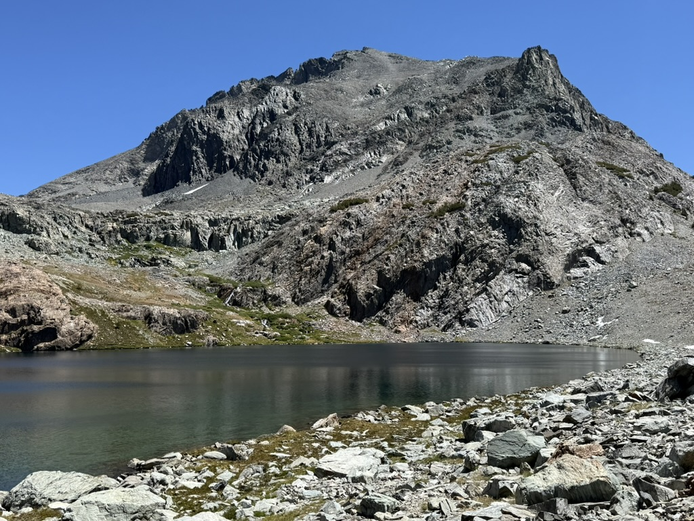{fig-align="center" height="400px"}
:::

::: {.column width="40%"}
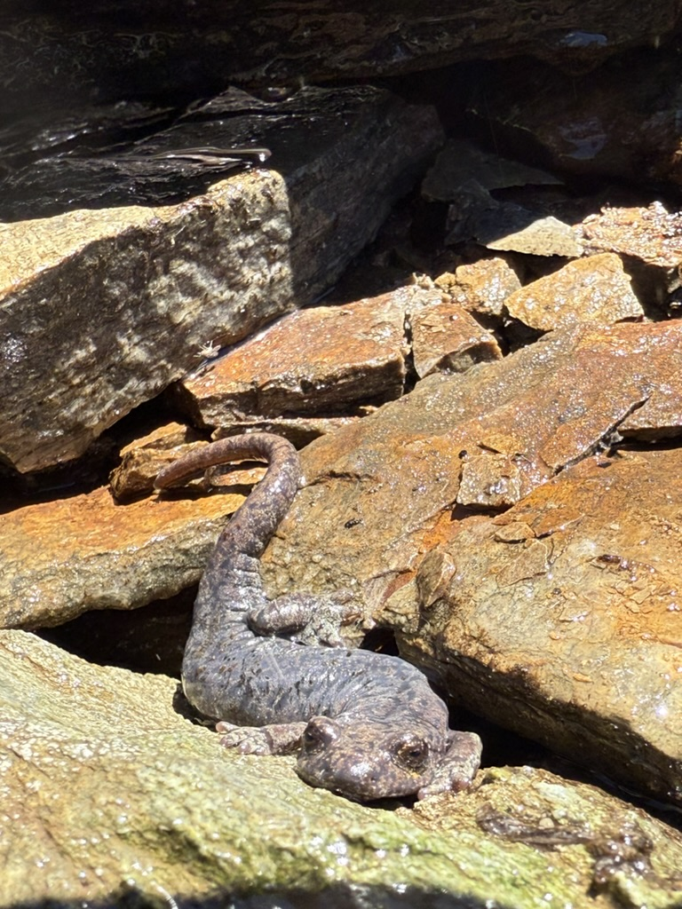{fig-align="center" height="400px"}
:::
:::::

## Laurel Lakes, Sequoia National Park {style="font-size: 0.8em"}

::: {style="font-size: 0.95em; margin-bottom: 0px;"}
- **9 *H. platycephalus*** on the northeast shoreline in 2024.
- **20-30 individuals** on southeast shoreline in 2025.
- Found 0-1m from lake: on wet rocks and moss.
:::

::::: {.columns style="display: flex; align-items: center;"}
::: {.column width="50%"}
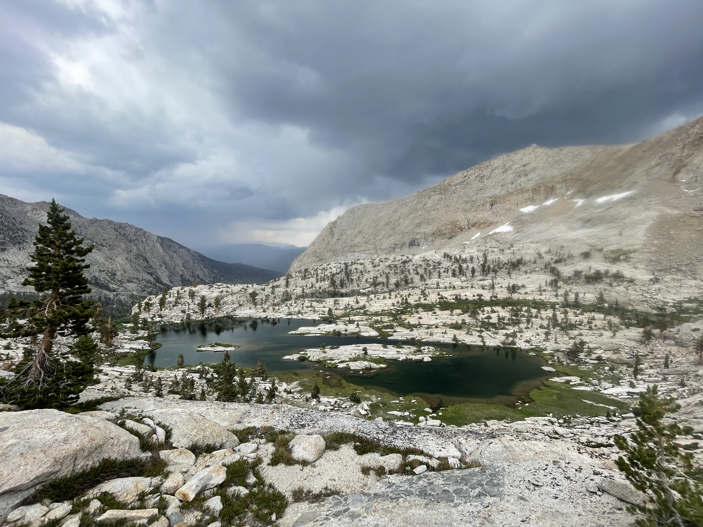{fig-align="center"}
:::

::: {.column width="50%"}
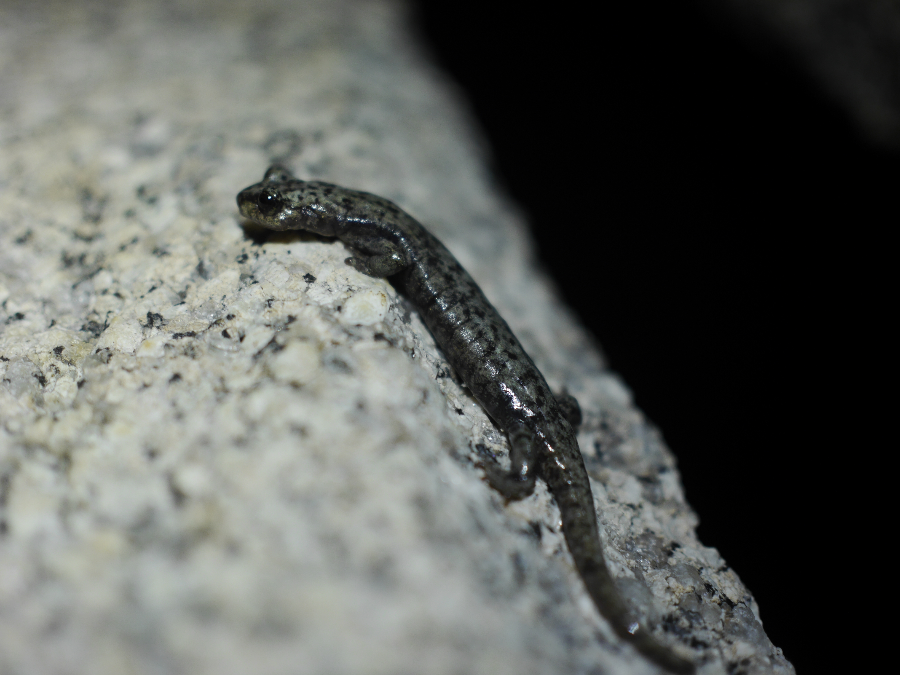{fig-align="center"}
:::
:::::

## Key Takeaways {style="font-size: 0.8em"}

:::{.incremental}
- [*Hydromantes platycephalus* inhabits lakeshores and even underwater littoral habitats.]{style="font-size: 1.1em"}
- [Previously unrecognized importance of lentic habitats for this species.]{style="font-size: 1.1em"}
- [~4km southern range extension west of Sierra crest.]{style="font-size: 1.1em"}
:::

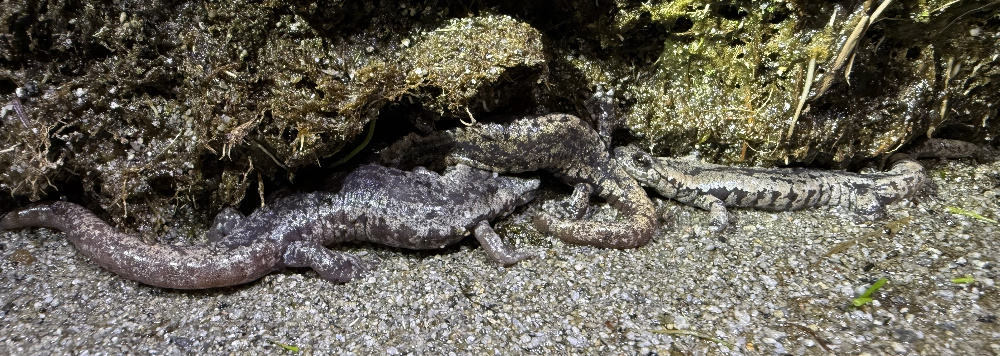{fig-align="center" width="500px"}
