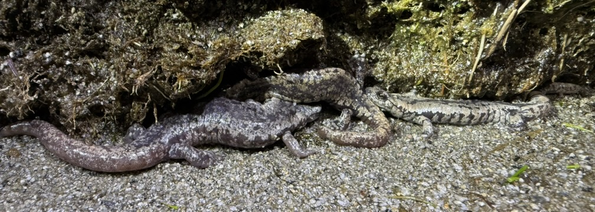

## The first description of Mount Lyell salamanders (*Hydromantes platycephalus*) occupying lakes in California's Sierra Nevada mountains

\

Parker Land\
[Sierra Nevada Aquatic Research Laboratory, Mammoth Lakes, California]{style="font-size: 0.4em"}

## Natural History {style="font-size: 0.8em"}

::::: columns
::: column
-   Endemic to the Sierra Nevada
-   One of the highest elevation salamanders in the world (Potluck Pass locality \~12,150ft)
-   Known to inhabit upland seeps and springs, stream margins, and waterfall spray zones
:::

::: column

:::
:::::

## *H. platycephalus* localities and our sites {style="font-size: 0.8em"}

::: {.r-stack}
{width="500px"}

{.fragment width="500px"}
:::

## South Lyell Basin, Yosemite National Park {style="font-size: 0.8em"}

::::: columns
::: column
-   60 H. platycephalus were found along the northern lake shore, including 3 submerged in the lake itself

-   Nearly all were observed on moss, in meadow vegetation, or at the base of a grassy bank along a sandy beach, and within 0–0.5 m of the lake.
:::

::: column
{height="48%"}
:::
:::::

##



## Goddard Plateau, Kings Canyon National Park {style="font-size: 0.8em"}

::::: columns
::: column
-   Nocturnal survey of entire lake shore, inlet and outlets
-   Two individuals observed on the of the lake's overhanging vegetated bank
-   Additionally, one was observed \~5m from the lake in a dry meadow habitat
:::

::: column

:::
:::::

## Laurel Lakes, Sequoia National Park {style="font-size: 0.8em"}

::::: columns
::: column
-   In 2024, 9 individuals were observed on the northeast shoreline
-   In 2025, 20-30 individuals were observed on southeast shoreline
-   In both instances, *H. platycephalus* were found on wet rocks and moss within 0-1m of the lake
:::

::: column

:::
:::::

## Key Takeaways {style="font-size: 0.8em"}

-   [*H. platycephalus* occupy lakeshores and even underwater littoral habitats]{style="font-size: 0.8em"}
-   [The high abundances observed during some surveys (\>60 individuals in one instance) suggests there is an unrecognized importance of lentic habitats for this species]{style="font-size: 0.8em"}
-   [Observations in the Laurel Creek and Coyote Creek drainages extend the southern range west of the crest for this species by \~4km]{style="font-size: 0.8em"}  {width=100px}
